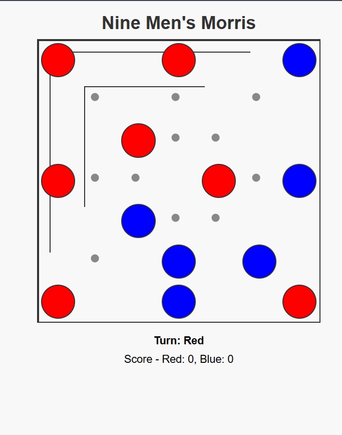

# Nine Men's Morris (Char and Bhar)

**Nine Men's Morris** (also known as *Char and Bhar*) is an ancient two-player strategy board game. Each player has nine pieces, and the board consists of 24 points where pieces can be placed. Players alternate turns placing pieces on empty points, aiming to form **mills** (three pieces in a row). When a mill is formed, the player immediately removes one of the opponent's pieces from the board.

After all pieces are placed, players take turns moving their pieces to adjacent empty points along the board's lines. Players continue to form mills and capture pieces during this phase. The game ends when one player is reduced to two pieces or cannot make a legal move. In that case, the other player wins.

---

## 🎮 Gameplay

- **Piece Placement**: Players start by alternately placing their nine pieces on empty points of the board.
- **Forming Mills**: When a player aligns three of their pieces in a row (*a mill*), they remove one of the opponent's pieces from the board.
- **Piece Movement**: After all pieces are placed, players take turns moving one of their pieces to an adjacent empty point, continuing to form mills and capture pieces.
- **Score Tracking**: The game keeps track of how many pieces each player has captured or has remaining.
- **Winning Condition**: A player wins by leaving the opponent with only two pieces or no legal moves.
- **Turn Indicator**: The interface highlights whose turn it is, so players always know whose move is next.

---

## 📷 Screenshot

---

## 🛠 Technologies Used

- HTML  
- CSS  
- JavaScript

---

## 👨‍💻 Credits

Game developed by **Kamlesh Gurjar**.
